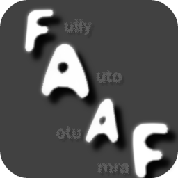

# FullY AutO - Auto Farm [FA-AF] ❤️

  
 <strong>FullY AutO - Auto Farm</strong> is a free open-source Murder Mystery Two script that aims to provide ease when autofarming    currencies like: 

  

    ✅ Coins 
  

  

    ✅ Beach Ball 
  

  

    ✅ Snow Tokens 
  

  

# Disclaimer ⚠️
1. **Forking, Using, or Copying:**  
   This is open-source, so you are free to use either the [technologies]() or the full [autofarm script](). However, you **MUST** give credit to me as a contributor. Example: *"Credits to Zynic" [[link to repository]]()*.

2. **Code Stability:**  
   This repository will remain up to date, and I will be releasing new versions of the [autofarm script]() so you can integrate it into your ScriptHubs. However, unlike [MM2-AutoFarm](https://github.com/Zyn-ic/MM2-AutoFarm), **I WILL NOT** be making adjustments for any executors other than [*Swift*](https://getswift.xyz/).

3. **Other Concerns?**  
   📧 Email me: **Zynicc@proton.me**  
    Discord: **zyn_ic** 
